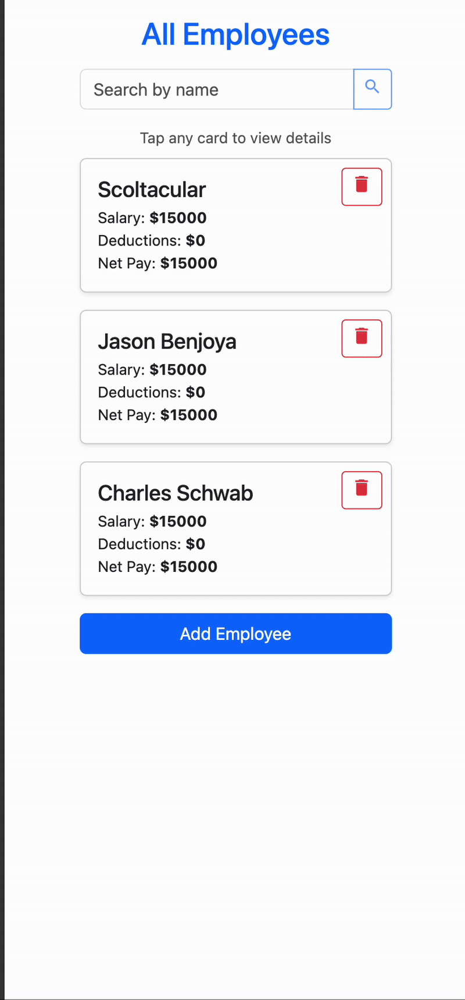

# Full-Stack HR Application - by Jason Benjoya

## Live demo: https://www.colab-music.com/

---

### PROJECT GOALS

The task was to create a simple full-stack web application for basic HR functions, specifically around payroll. This application is a simple and fully-featured MVP, with the ability to view, create, update, and delete employees. Employee metadata includes their name, salary, and various pay deductions, as well as the calculated net pay. The technologies used:

- HTML5
- CSS3
- Typescript
- Bootstrap
- Axios
- PostgreSQL
- NodeJS
- ExpressJS
- ReactJS

---

### ABOUT THE APP

This app is, in the simplest terms, a very basic payroll viewing and editing system. Given the open-ended nature of the project prompt, I made choices about the desired feature-set that allow for future expansion and improvement.

---

### System Design Choices

#### Database:

I decided to use a lightweight PostgreSQL database for this project to store employee and deduction data. I wanted the ability to categorize deductions explicitly by type (tax, benefits, etc), which made for a great use-case for its own table. Each deduction has a foreign key to the given employee, as well as the amount and type. For any given employee, they can only have at most one deduction of each type.

Considerations: Due to the simple nature of this app, having a NoSQL database could also work just as well, and would still have the ability to track deductions for employee by type. However, the structured nature of the SQL database made for a much simpler way to do database-level calculations for the total deductions and net pay, which made for a more efficient server. The tradeoff, of course, comes with the desire to add more possible types for the Deductions, which will require a database migration.

#### Server

I used a simple nodeJS/ExpressJS server for my backend. I utilized the KnexJS ORM to interface with my database, which includes all necessary operations to create the tables and functions there-in. The backend uses TypeScript for more explicit type safety. I split the logic between repositories, controllers, and routes, so that each layer would be responsible for an explicit task. The repositories do all of the database operations, controllers call those methods and return the express responses back to the routes, which utilize any middleware that may be needed.

In the case of this app, the only middleware I added was a zod validation middleware for mutating operations, and a global error handler for cleaner and more explicit error handling.

#### Front End

The front end was created a single-page application using ReactJS with typescript, and was scaffolded for ease of creation using `create vite` tool. The front-end uses an api interface service with axios to centralize all api logic in one locaiton. Each operation is then called in a custom react hook that is meant to run only that operation (separation of concerns, encapsulation). I used a simple React router that could navigate to my three major routes for viewing all employees, viewing/editing a single employee, or creating an employee. There is also a catch-all not-found page for any mal-formed URLs. The whole app is styled using bootstrap utility classes. The front-end has clearly delineated pathways for all CRUD operations required for this app.

### FRONT END/USER FLOW

NOTE: This app was created with the mobile-first mindset, so users can/should feel empowered to utilize either desktop or mobile (or anything in between) to access the application.

#### <ins>Landing Page</ins>

The main landing page is simply the employee list page. Any already-created employees will show on this page either in a table, or a card format (Depending on the form factor of the user's device). If no employees exist a simple message alerts the user to this situation. There is also a button on this page to create a new employee, which will navigate the user to the employee creation page.

The fields shown in the cards and table rows for each user include their name, their salary, the sum of all deductions they pay, and finally the calculation of their net pay. The table view is fully sortable.

Users can also find an employee search bar at the top that allows them to filter the list by name. On desktop, the search is in real time (with a short debounce to comply with UX standards), and on mobile, due to the presence of virtual keyboards, the filtering logic waits for a submit button press. The search is case insensitive and will find any records with partial matches.

Desktop

Mobile

At the bottom of the landing page, as well as in the navigation bar, there are links to login or signup, in order to gain access to all of Colab's features.

#### <ins>Create User</ins>

Clicking the "Add Employee" button will navigate to the `/employees/create` route, which displays a fully empty form for creating a new employee. The available fields are for name, salary, and deductions. The deductions fields are unique. A dropdown is present for selecting what type of deduction a user wants to create for the employee. Clicking "add deduction" will create a new deduction input group, which will show the type as well as the amount.

Mobile Creation with Dropdown

Mobile Creation With Deductions

The entire form has validation for each field as well as custom error messaging for any API errors.

Desktop Creation with Validation

#### <ins>View/Edit User Details</ins>

Once a user is created, or if a table row/card is clicked from the main list page, the user is navigated to the employee details page, located at `/employees/:id`.

On this page, the user can see much more granular detail about the employee's data. Along with the total sum of deductions and the net pay, each deduction present for a given employee is shown with its amount, so the user can see how the total is broken down.

From this view, a user can click the edit button, which will bring up the same form as the create page, only with initial values prepopulating the fields. They can also return back to the main page by clicking the `Back` button at the top.

View Employee Details

Edit Employee Details

#### Adding and Deleting Dedutions

For a given deduction on the create and edit pages, a `delete` button exists. The behavior of this button depends upon whether the deduction is newly added, or if it already existed for the employee. When adding a deduction, it is not saved to the database and linked with an employee until the `Update Employee`
or `Create Employee` button is pressed, thus running the method to hit the respective API endpoint. Before that point, each deduction is a simple UX component, and pressing the delete key will simply clear it from the UI.

If, however, the deduction was pre-populated in the form while editing an employee, pressing the delete button will trigger a modal alerting the user that the deduction will be deleted from the database, and that such an operation cannot be undone. Even upon cancelling from editing the form itself, a deleted deduction will remain deleted.

#### Cancelling an Edit or Creation

The form for creaeting and editing an employee keeps track of dirty (edited) fields. If a user attempts to cancel a form that has been edited, they will be alerted with a modal asking if they are sure. If a user attempts to cancel editing a form they have not changed, they will simply be navigated away.

The navigation destination is dependent on the operation (create vs edit). If the user was attempting ot create a new employee, they will be navigated back to the main `/` route to the full employee list. If editing, they will be navigated to the `/employees/:id` route to view the employee details.

Note that in either case, successfully saving the form will navigate the user to the `/employees/:id` route to see the full employee details.

#### Deleting an Employee

If a user wishes to delete an employee, they can do so from the main list page. Whether on mobile or desktop, each employee record displays a delete button. Upon pressing, a user is alerted that this is a permanent action and is given the chance to cancel. If they do proceed, the employee record is immediately removed from the UI and can no longer be accessed.

Mobile

Desktop

#### Running Backend Tests

All unit tests were created using the Jest testing library, with the integration tests utilizing the Supertest library as well. The testing suite currently contains 39 tests in total, which provides roughly 92% coverage over all back-end operations.

---

### Running the App

To run the app locally on your machine, clone this repository or download the code directly to your machine. From each folder, backend and frontend, run `npm install` to install all necessary packages and dependencies.

MAKE SURE YOU HAVE POSTGRESQL INSTALLED ON YOUR MACHINE BEFORE YOU CONTINUE.

From the backend folder, first set up the database by running `npm run db:setup`. Next, run `npm run dev` to start up the development server on `localhost:3001`. From the colab-frontend folder, run 'npm start' to start up the development server on the front end.

**Note** It is highly recommended to copy over the values in `.env.example` to your own `.env`. You can change the values as desired. The app will still run using default fallback values for each env variable. 
